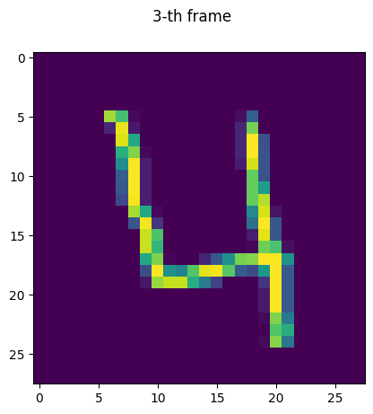
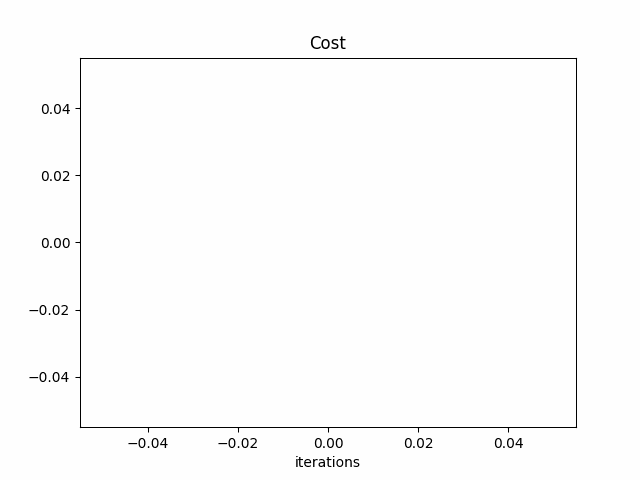

# DigitRecognizer

This project allows to recognize a specific digit represented by a handwritten digit picture.

Here an example of a digit photo (the '4' digit is represented)

The recognition has been done with no ML librairy (just numpy), it has been done by implementaing a logistic regression algorithme coded from scratch.
A LogisticRegression class has been created. Each instance of this class allows the recognition of one specific digit. To algorithme has been tested trying to recognize the digit '4'.

With 100 iterations, accuray $\approx$ 95 % on the training data
